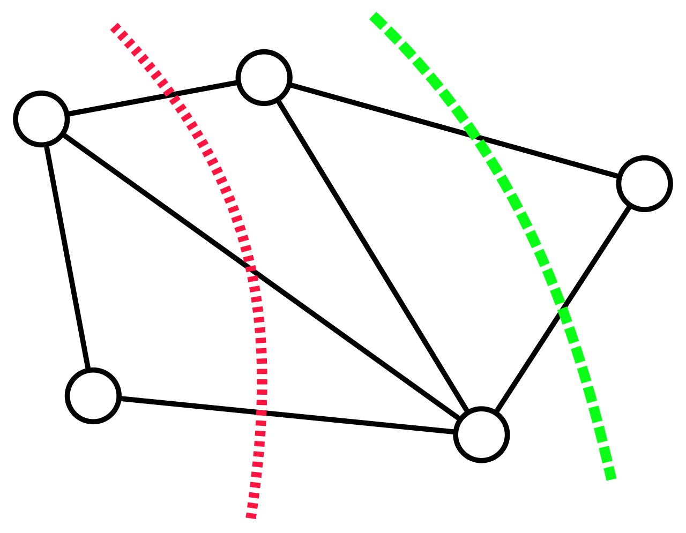

# Metaheuristics ofr minimum k-cut problem

## Intro

**Minimum k-cut** - combinatorial optimization problem that requires finding a set of edges whose removal would partition the graph to at least k connected components. These edges are referred to as **k-cut**. The goal is to find the **minimum-weight k-cut**. This partitioning can have applications in VLSI design, data-mining, finite elements and communication in parallel computing.

The problem is NP-complete if k is part of the input. It is also NP-complete if we specify k vertices and ask for the minimum k-cut which separates these vertices among each of the sets.

### Dictionary
**cut** - a partition of the vertices of a graph into two disjoint subsets.

_A graph and two of its cuts. The dotted line in red represents a cut with three crossing edges. The dashed line in green represents one of the minimum cuts of this graph, crossing only two edges. source: [wikipedia](https://en.wikipedia.org/wiki/Minimum_cut#/media/File:Min_cut_example.svg), CC BY-SA 3.0_

**minimum cut** - a cut that is minimized in some metrics.

**minimum k-cut** - a type of minimum cut, where the output is graph partitioned to _at least_ _k_ connected components.

**weighed graph** - a graph whose vertices or edges have been assigned weights. A vertex-weighted graph has weights on its vertices and an edge-weighted graph has weights on its edges.

In the context of the minimum k-cut problem, the additional optimization requirement for partitioning the graph is to do it in a way that would minimize (or _maximize_) the value of edges being removed.

## Algorithm description
Various metaheuristics will be implemented & compared in a scope of a minimal k-cut problem for the weighed graph. 

### Formalization
For undirected weighted graph G = ( V, E ), where:
- V is a set of vertices,
- E is a set of edges where each edge (u,v) ∈ E is assigned a weight w(u,v) ≥ 0 and u,v are vertices connected by the given edge.

The aim is to divide graph G into exactly _k_ sub-graphs _G1, G2, ..., Gk_, minimizing the summed cost of all edges removed.

> min ∑(u,v) ∈ E w(u,v) ⋅ xuv

## Repo structure
- **data/** - directory with test data
- **include/** - directory with globally used utilities. 

- **importer.h** - utilities related to importing; currently works only for csv files and into adjacency matrices.
- **graphs.cpp** - used for graph generation and visualisation; _temporarily main equivalent._
